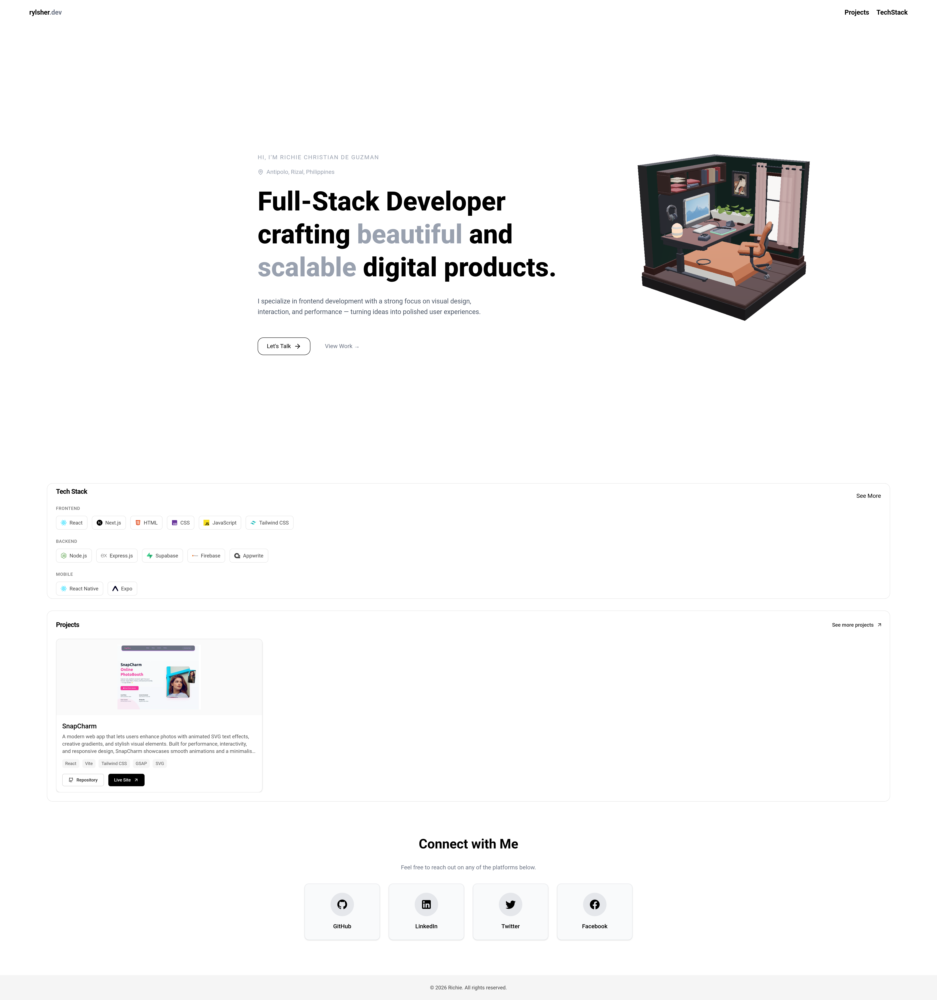
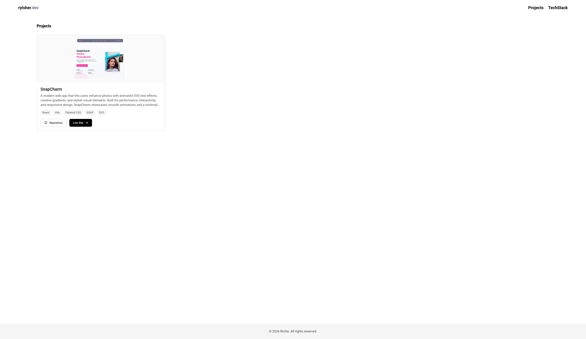

# Richie Christian De Guzman – Portfolio

A modern, minimalist developer portfolio showcasing my projects, tech stack, and socials.  
Built with performance, responsiveness, and clean UI in mind.

🌐 Live Site: https://richie-christian-de-guzman.vercel.app/

---

## Preview

### Desktop View

---

## Tech Stack

- **Framework:** Next.js (App Router)
- **Frontend:** React, TypeScript
- **Styling:** Tailwind CSS
- **UI / Icons:** Lucide, Iconify
- **Animations:** GSAP, Framer Motion
- **3D:** React Three Fiber, Drei
- **Carousel:** Embla Carousel
- **Deployment:** Vercel

---

## Features

- Fully responsive design (mobile → desktop)
- Interactive project carousel
- Dedicated projects page
- Socials page with external links
- Contact form UI
- Smooth micro-interactions and hover states
- Optimized images with `next/image`
- Clean, minimalist aesthetic

---

## Pages

- `/` – Home
- `/projects` – Full projects showcase
- `/socials` – Social links and contact form

---

